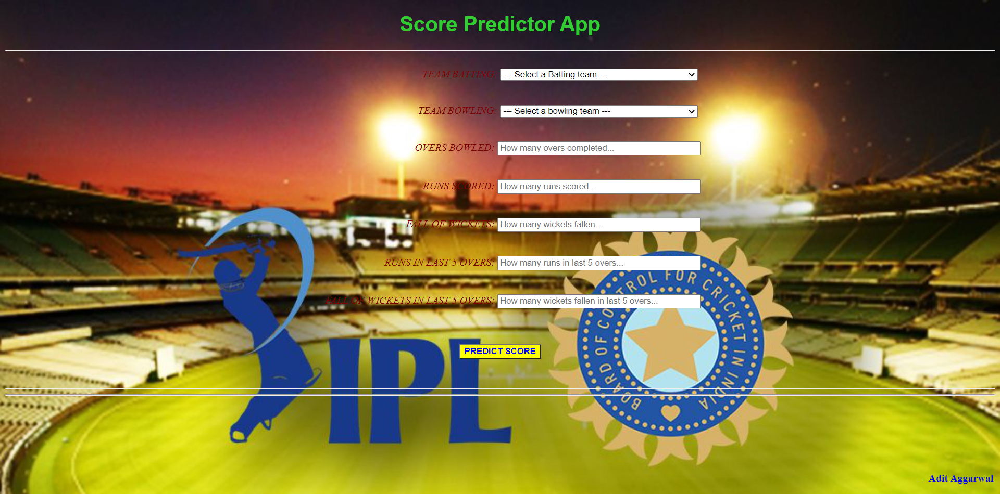

# Score Prediction App 
This is a web app based on machine learning which predicts scores of ongoing IPL match.

## Aim
The aim is of this web app is to get approximate runs that could be scored based on overs bowled,runs scored till now and in last 5 overs,wickets fallen till now and in last 5 overs.
## Module Used for NLP

Linear Regression Algorithm is used for prediction of score.Various regression models have been applied for more accurate prediction.
Flask is used to getting information from user and predicting it using the above model.It was deployed using heroku.

## Steps Performed under NLP

1. Select the approproate fields from the data.
2. Train model on the data.
3. Do some Hyperparameter tuning.
4. Save th model.
5. Deply using flask frame-work.

## Output:
Image 1\
\
Input\
\
Output\
\
